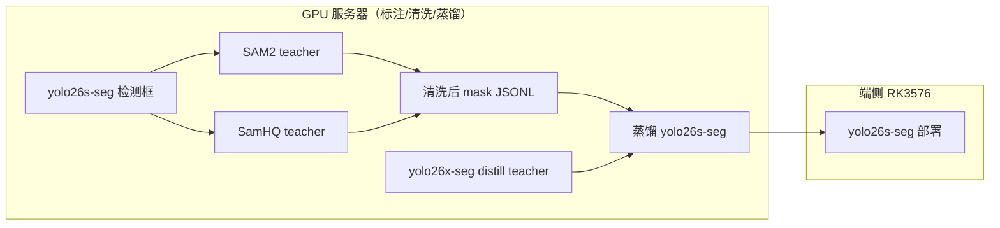

# 模型分层：端侧部署 vs GPU Teacher

> 原则：**yolo26s-seg 是端侧唯一分割学生**；auto-label、数据清洗、蒸馏 teacher 可使用 SAM / SamHQ 等 GPU 模型，**不部署到 RK3576**。

## 分层一览

| 层级 | 模型 | 运行环境 | 用途 |
|------|------|----------|------|
| **Edge 学生** | `yolo26s-seg` | RK3576 / 移动端 | 在线推理、端侧分割 |
| **Segment Teacher** | SAM2 (`sam2_b.pt`) | GPU | 默认 auto-label mask |
| **Boundary Teacher** | SamHQ (`sam_hq_vit_b.pt`) | GPU | bad_boundary / review 重标 |
| **Distill Teacher** | `yolo26x-seg` | GPU 训练 | ultralytics/ 蒸馏 teacher |
| **Matting Teacher** | Bv / Bi / Bd / Bs | GPU 外部进程 | alpha 重标注（stage 7） |
| **Ablation** | GrabCut (CPU) | CPU | benchmark 对照，禁止生产 |

## 数据流



## 配置

机器可读注册表：`configs/models.yaml`

```yaml
models:
  edge:
    name: yolo26s-seg
    weights: .../yolo26s-seg.pt
  teachers:
    sam2: { backend: sam2, weights: sam2_b.pt }
    samhq: { backend: samhq, weights: sam_hq_vit_b.pt }
```

`labeling` 段覆盖 teacher 选择（不影响 edge 检测权重）：

```yaml
labeling:
  yolo_weights: .../yolo26s-seg.pt      # edge 检测
  segment_teacher: sam2                 # 或 samhq
  teacher_weights: sam2_b.pt
  segment_mode: sam2                    # 兼容旧字段
```

查看当前解析结果：

```bash
hmp config models
hmp config models -c configs/coconut_relabel.yaml
```

## CLI / Provider

| 命令 | Edge | Teacher |
|------|------|---------|
| `hmp label yolo-sam2 --segment-mode sam2` | yolo26s-seg | SAM2 |
| `hmp label yolo-sam2 --teacher samhq` | yolo26s-seg | SamHQ |
| `hmp pipeline run-relabel --provider yolo_samhq` | yolo26s-seg | SamHQ |
| `hmp pipeline run-relabel --provider yolo_grabcut` | yolo26s-seg | GrabCut ablation |

Benchmark 四模式网格仍用 `detector × sam_mode`；生产迭代计划优先 `yolo_person + sam2`，bad_boundary 样本可切换 `samhq` 重标。

## 代码模块

| 模块 | 职责 |
|------|------|
| `src/hmp/models/tiers.py` | edge/teacher 注册表 |
| `src/hmp/labeling/sam_teacher.py` | SAM2/SamHQ/GrabCut 统一 adapter |
| `src/hmp/labeling/auto_label_core.py` | yolo 检测 + teacher 分割 + QA |
| `src/hmp/labeling/labeler_factory.py` | `yolo_sam2` / `yolo_samhq` provider |

SamHQ 外部权重可通过 `teachers.samhq.command_template` 接 subprocess，与 matting alpha teacher 同一 adapter 模式。

## 与 ultralytics 蒸馏的关系

- **segPipeline**：数据 auto-label、质量门控、mask→matte 重标注
- **ultralytics/**：`yolo26x-seg` → `yolo26s-seg` 特征/proto 蒸馏（见 `distill_model.py`）

两者共用 COCONut / LVIS 数据，但职责分离：segPipeline 产出清洗 mask；ultralytics 负责 student 权重训练。
